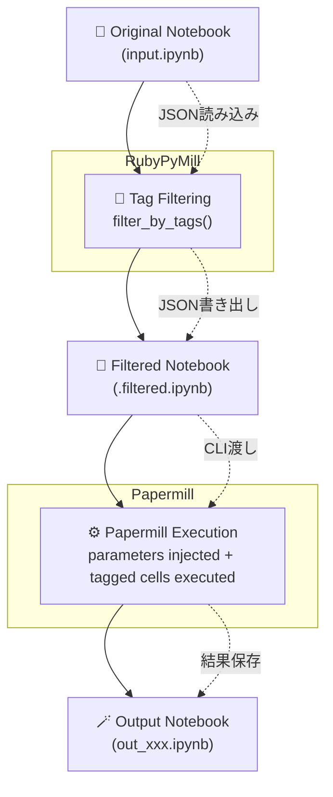

# RubyPyMill 💎🔁📓
**Running Notebooks the Ruby Way — RubyPyMill and the Art of PoC Automation**

---

## 🧭 背景と目的
RubyPyMill は、Ruby から **Papermill（Python Notebook Runner）** を制御して、  
「PoC（概念実証）で生まれた知見を業務システムに橋渡しする」ための  
軽量ランナー／自動化スターターです。

PoC は終わりではなく、組織的な知識循環のはじまり。  
Ruby の表現力と Python の実行力をつなぎ、  
“Ruby らしいかたちでデータと協働する” 開発サイクルを目指します。

---

## 💡 設計思想 — Ruby 4.0 @30 に寄せて
RubyPyMill は、**Ruby4.0 の理念「多言語協調」** に沿って設計されています。  
Ruby が DSL（制御・記述）を担い、Python が Notebook（実行・計算）を担う。  
その橋渡しを自動的に行うことで、  
Ruby の世界から Notebook の再現性をそのまま利用できる環境を実現します。

> 💬 *"Ruby は、人と人、そしてツールとツールの協調を目指す。"*  
> — Yukihiro “Matz” Matsumoto

---

## 🧩 概念図
```text
+----------------+     +-------------------+     +----------------+
| Ruby / CLI /   | --> | Papermill Runner  | --> | Jupyter Notebook |
| Rake / CI/CD   |     | (via Python3)     |     | (PoC実行環境)    |
+----------------+     +-------------------+     +----------------+
         ↑                         ↓
|---------- データ・成果物共有 ----------|
```

---

## 📁 構成概要
| ディレクトリ | 内容 |
|--------------|------|
| .vscode/ | VS Code 設定（推奨拡張、lint/format、tasks、debug） |
| .github/workflows/ | CI（Ruby と Python の lint/test） |
| bin/ | CLI（ruby_pymill 実行スクリプト） |
| lib/ | RubyPyMill ライブラリ本体 |
| py/ | Python 側（Papermill 実行環境） |
| examples/ | サンプル（notebook/params/output） |

---

## ⚙️ セットアップ
```bash
# Ruby セットアップ
bundle install

# Python 仮想環境構築と依存パッケージ導入
python3 -m venv .venv && source .venv/bin/activate
pip install -r py/requirements.txt

# Python カーネル登録（Papermill 実行用）
python -m ipykernel install --user --name python3
```

---

## 🧪 動作確認（Dry Run）
```bash
bundle exec ruby bin/ruby_pymill exec examples/notebooks/sample.ipynb \
  --output examples/outputs/out.ipynb \
  --params examples/params/demo.json \
  --kernel python3 \
  --dry-run
```

---

## 💻 使い方（CLI）
```bash
ruby_pymill exec <input_ipynb> \
  --output <output_ipynb> \
  [--kernel python3] \
  [--params params.json] \
  [--cwd path] \
  [--dry-run]
```

---

## 🔄 RubyPyMill 実行フロー（Visio風構成）


---

## 🧠 処理概要
| フェーズ | 処理内容 | 実行主体 |
|-----------|-----------|-----------|
| ① Notebook読込 | `.ipynb` をJSONとして読み込む | RubyPyMill |
| ② タグフィルタ | 指定された複数タグをOR条件で抽出し、`parameters`セルを保持 | RubyPyMill |
| ③ 一時保存 | 抽出セルのみで `.filtered.ipynb` を生成 | RubyPyMill |
| ④ 実行 | Papermillで `.filtered.ipynb` を1回だけ実行 | Papermill |
| ⑤ 出力 | 実行結果を `out_xxx.ipynb` として保存 | Papermill |

---

## ⚙️ 複数タグ対応の実行例
```bash
ruby -I ..\RubyPyMill\lib ..\RubyPyMill\bin\ruby_pymill exec project\kodama-poc\notebooks\20251010_casting_defects_poc.ipynb `
  --output project\kodama-poc\outputs\out_multi.ipynb `
  --kernel rpymill `
  --cell-tag "parameters,setup,preprocess,analysis" `
  --params project\kodama-poc\params\kodama-casting.json
```

---

## 🧩 RubyPyMill の役割
> **Papermill の上位制御層**  
> ノートブックを論理的に分割・整形し、  
> 必要なセルだけを抜き出して **Papermillへ渡す制御層**。

| 特徴 | 説明 |
|------|------|
| ✅ 複数タグを柔軟に指定可能 | parameters + preprocess + analysis などを一括実行 |
| ✅ セッションを1回に統合 | Papermill のカーネルを維持したまま実行 |
| ✅ 再現性の高いPoC | Notebookを部分実行しても構造が崩れない |
| ✅ Ruby的な制御性 | Ruby DSL + JSON 制御で完全自動化が可能 |

---

## 🔌 プログラムからの利用について（実験的）
RubyPyMill は CLI ツールとしての利用を主眼に設計されています。

内部的には、`RubyPyMill::API` に実装された  
Ruby レベルの実行 API が存在し、  
Ruby のコードから直接呼び出すことも可能です。

これにより、バッチ処理やジョブスケジューラ、  
将来的な Web API への組み込みが可能になります。

現時点では CLI を安定したインターフェースと位置づけており、  
プログラムからの利用方法は **実験的な扱い** とし、  
将来変更される可能性があります。

---

## 📘 ライセンス
MIT License  
© 2025 Hiroshi Inoue / OSS-Vision

---

## 🪞 補記
RubyPyMill は OSS-Vision と Ruby コミュニティの協調実験として開発されています。  
この仕組みが、地方の技術チームや PoC 実務の現場における  
「試行と業務の橋渡し」の一助となることを願っています。

---

## 🔧 提案メモ
- `.github/workflows/ci.yml` にこの README を反映した  
  **自動 Notebook 実行ジョブ** を加えると、  
  “ドキュメントから PoC が実行される” 世界が完成します。
- README 上部のサブタイトル（💎🔁📓）は GitHub 表示時に映えるので残しましょう。
